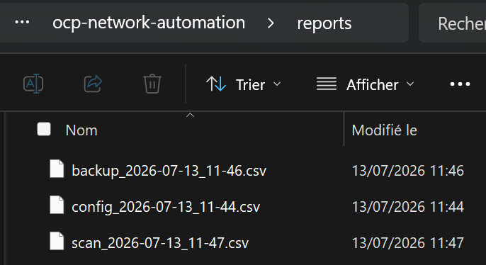
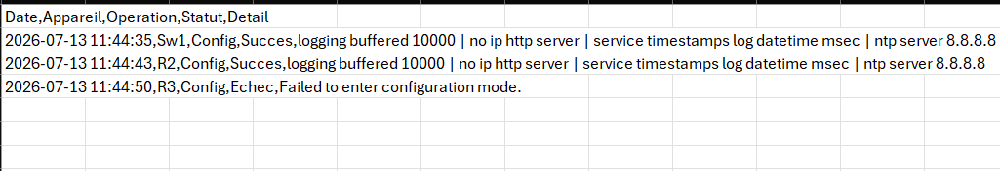
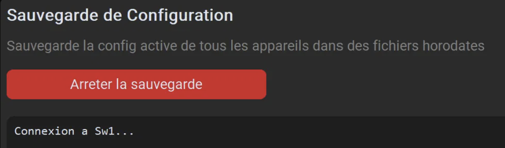
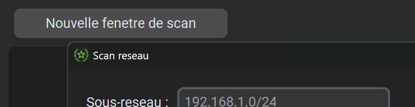
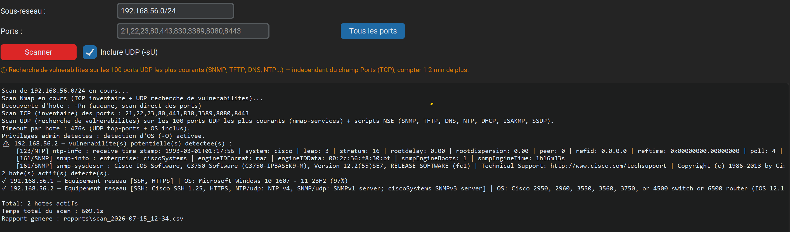
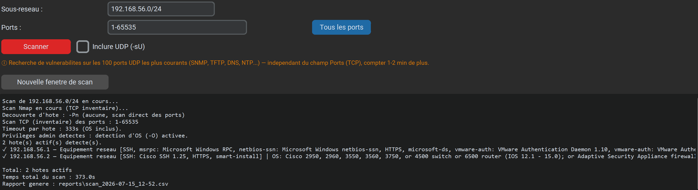

# OCP Network Automation

Application Python d'automatisation des opérations réseau — OCP Jorf Lasfar (350+ switches Cisco)

---

## Progression du projet

### v0.1 — 24 juin 2026 — Connexion SSH de base
Premier script Python capable de se connecter à un équipement Cisco via SSH et récupérer son hostname.


### v0.2 — 24 juin 2026 — Connexion multi-équipements
Connexion simultanée à R1, R2 et R3 — récupération du hostname de chaque équipement.


### v0.3 — 24 juin 2026 — Envoi de configuration groupée
Envoi de commandes de configuration sur R1, R2 et R3 simultanément via SSH.
Vérification appliquée directement sur les équipements.


### v0.4 — 25 juin 2026 — Chargement des équipements depuis Excel
Import automatique de la liste des équipements depuis un fichier Excel (devices.xlsx).
Plus besoin de modifier le code pour ajouter un équipement.


### v0.5 — 25 juin 2026 — Sauvegarde automatique des configurations
Sauvegarde automatique de la running-config de chaque équipement dans des fichiers horodatés.


### v0.6 — 25 juin 2026 — Première interface graphique
Première version GUI avec Tkinter — boutons Envoyer Config et Sauvegarder avec log en temps réel.
Logo OCP intégré dans la barre de titre.


### v0.7 — 25 juin 2026 — Interface modernisée avec CustomTkinter
Interface repensée avec CustomTkinter — thème sombre, onglets Envoi Config et Sauvegarde.
Traitement en arrière-plan pour éviter le gel de l'interface dans les ancienne version.


### v0.8 — 26 juin 2026 — Ajout onglet Scanner Réseau
Scan de sous-réseau en parallèle (50 threads) — détecte tous les hôtes actifs en temps réel.
Utile pour vérifier quels équipements sont en ligne avant de pousser une configuration.


### v0.9 — 1 juillet 2026 — Test sur switch Cisco réel + améliorations UI
Premier test réussi sur un vrai switch Cisco Catalyst 3750 (WS-C3750V2-24TS) en environnement LAN.
- Ajout mode clair/sombre avec mémorisation
- Historique des scans cliquable
- Détection du type d'équipement (SSH/Telnet/RDP)
- Labels descriptifs sur chaque onglet


### v1.0 — 2 juillet 2026 — Zone de texte + chargement de fichier de commandes

Ajout d'une interface plus flexible pour l'envoi de configuration : possibilité de
taper les commandes directement dans l'application ou de charger un fichier .txt
existant, sans devoir passer uniquement par `commands.txt`.

- Zone de texte editable pour taper les commandes directement dans l'UI
- Bouton "Parcourir .txt" pour charger un fichier de commandes existant
- Priorite automatique : zone de texte > commands.txt si la zone est vide
- Fenetre redimensionnable avec taille minimale (UI ne casse plus en dessous d'une certaine taille)
- Teste et valide sur switch Cisco Catalyst 3750 reel (site Jorf Lasfar) :
  push de `service timestamps debug datetime msec localtime`, confirme via
  `show running-config | include service timestamps` en SSH direct


### v1.1 — 3 juillet 2026 — Corrections UX + détection d'erreurs + zoom

Corrections de bugs identifies lors des tests sur switch reel, et ajout de
controles pour rendre l'envoi de configuration plus sur.

- Bouton d'arret en cours d'envoi ("Arreter l'envoi") : empeche les clics multiples
  qui melangeaient le log de resultat
- Fix du glitch visuel au changement de theme dark/light
- Detection des commandes rejetees par le switch (`% Invalid input`, `% Incomplete
  command`, etc.) au lieu d'un faux message de succes
- Controles de zoom (+/-) : le contenu devient scrollable a tout niveau de zoom,
  la fenetre elle-meme ne change jamais de taille
- Correction du bouton de suppression dans l'historique du scanner, invisible en mode clair


### v1.2 — 8 juillet 2026 — Scan reseau professionnel avec Nmap

Remplacement du scan basique (ping + test de 5 ports en dur) par un vrai scan
Nmap (python-nmap), avec detection de versions de services et d'OS.

- Detection des versions de services (ex: "HTTP: Huawei router http admin")
  au lieu de juste "port ouvert"
- Detection d'OS avec pourcentage de confiance (ex: "Linux 3.18.24 (96%)")
- Champ "Ports" configurable (syntaxe Nmap : liste ou plage), 9 ports par
  defaut adaptes a un contexte reseau/IT (SSH, Telnet, HTTP, NETCONF, etc.),
  avec un bouton "Tous les ports" (1-65535)
- Scan toujours en -Pn (aucune decouverte d'hote) : ne rate jamais un hote qui
  repond au ping mais est ignore par la decouverte Nmap standard (ex routeur
  GNS3), sans surcout de temps mesurable (verifie via benchmark_scan.py)
- Deux objectifs distincts : le TCP (champ "Ports") sert a l'INVENTAIRE reseau
  (appareils + services), l'UDP sert a la RECHERCHE DE VULNERABILITES sur les
  services UDP les plus a risque — pas a un inventaire de ports exhaustif
- Option "Inclure UDP (-sU)" : scanne les 100 ports UDP les plus COURANTS (approche
  "top ports" de Nmap, basee sur les frequences reelles du fichier nmap-services —
  meilleure couverture qu'une liste figee), en union avec les ports vuln curatee
  (SNMP, TFTP, DNS, NTP, DHCP, ISAKMP, SSDP) toujours inclus. Independant du champ
  "Ports" (qui ne concerne que le TCP). Des scripts NSE de detection (snmp-info,
  tftp-enum, dns-recursion, ntp-monlist, ike-version, upnp-info...) se declenchent
  sur leurs services respectifs quel que soit le port. Les vulnerabilites potentielles
  sont listees dans les logs et signalees dans le detail de l'hote (flag "⚠ Vuln: ...").
  Nombre de ports configurable (TOP_UDP_PORTS_COUNT). NB : --top-ports ne pouvant pas
  coexister avec -p dans une meme invocation Nmap, la liste UDP est calculee depuis
  nmap-services et combinee au TCP via "T:<ports>,U:<top-udp>"
- Timeout par hote (--host-timeout) dynamique, modele cout-fixe + cout-marginal
  calibre sur mesures reelles : 30s pour les ports par defaut, ~5-6 min pour un
  scan 1-65535 TCP, ~8 min pour 1-65535 TCP + UDP(100) + OS. Le cout UDP reste
  borne (nombre de ports "top" + cout des scripts), plus jamais de timeout a rallonge
- Detection d'OS (-O) activee seulement si l'app tourne en administrateur :
  detectee AVANT le scan, ce qui evite la tentative -O vouee a l'echec suivie
  d'un second scan complet de repli (qui doublait le temps)
- Hotes coupes par le timeout signales explicitement dans les logs (au lieu de
  disparaitre en silence et de laisser croire a une absence d'hote)
- Bouton "Nouvelle fenetre de scan" : ouvre une fenetre independante (avec le
  logo OCP) pour lancer PLUSIEURS scans en parallele (ex : plusieurs sous-reseaux
  a la fois). Chaque fenetre gere son propre scan de A a Z (champs, log, thread,
  annulation) sans etat partage ; fermer une fenetre annule proprement son scan
  (arret du sous-processus nmap.exe). L'historique reste commun a toutes les fenetres.
  La fenetre s'ouvre au premier plan avec le focus, et ses libelles reviennent a la
  ligne (responsive) quand elle est etroite
- Bouton de sauvegarde protege contre les clics multiples (meme mecanisme que
  l'envoi de config) : "Arreter la sauvegarde" pendant l'execution, plus de
  sauvegardes lancees en parallele par des clics repetes
- Repli automatique sur le scan basique si Nmap/python-nmap est absent, avec
  message clair a l'utilisateur
- Bouton "Arreter le scan" : interruption reelle et immediate du scan Nmap en
  cours (pas juste a la fin), via arret direct du sous-processus
- Demarrage de l'application accelere (imports lourds charges a la demande
  plutot qu'au lancement)
- Temps total du scan affiche a la fin, pour comparaison

Teste sur reseau domestique reel : 7 hotes detectes sur un /24, avec
identification correcte du routeur (Huawei, Linux embarque, 96% de confiance).


### v1.3 — 13 juillet 2026 — Reporting CSV

Generation automatique d'un rapport CSV recapitulatif apres chaque operation
(push config, backup, scan reseau), exploitable directement dans Excel.

- Un fichier horodate par execution (reports/config_..., backup_..., scan_...)
- Une ligne par appareil/resultat : date, appareil, operation, statut, detail
- Encodage UTF-8 avec BOM pour un affichage correct des accents dans Excel
- Rapport non genere si l'operation n'a produit aucune ligne (pas de fichier vide)
- Chemin du rapport affiche dans le log de l'app a la fin de chaque operation

Teste en conditions reelles sur le reseau OCP (Jorf Lasfar) : rapports de
config (Sw1/R2/R3) et de scan (192.168.56.0/24) generes et verifies.




### v1.4-1.5 — 14-15 juillet 2026 — Scan complet, fenetres multiples, UDP cible sur vulnerabilites

**v1.4 — Scan complet et fenetres de scan multiples**
- Decouverte toujours en -Pn (case a cocher supprimee, aucun gain de vitesse mesure)
- Bouton "Tous les ports" (1-65535) + timeout calcule dynamiquement selon le
  nombre de ports et la detection d'OS
- Plusieurs scans en parallele dans des fenetres separees independantes (bouton
  "Nouvelle fenetre de scan"), chacune avec son propre thread et son propre
  rapport CSV
- Bouton de sauvegarde desormais protege contre les clics multiples (meme
  pattern que config/scan)

**v1.5 — UDP redefini comme recherche de vulnerabilites ciblee**
- Le scan UDP ne scanne plus une plage de ports (impraticable, notamment contre
  Windows) mais les 100 ports UDP les plus courants (donnees Nmap) + 8 ports a
  haut risque (SNMP, TFTP, DNS, NTP, DHCP, ISAKMP, SSDP), avec des scripts NSE
  de detection de vulnerabilites
- Les vulnerabilites potentielles detectees sont signalees clairement dans le
  log et incluses dans le rapport CSV

Teste sur le reseau OCP (Jorf Lasfar) : scan complet TCP + OS sur 2 hotes
reussi en 366.6s sans timeout ; detection de vulnerabilite reelle validee sur
Sw1 (service NTP non synchronise, stratum 16) et sur un PC Windows (en-tete
serveur HTTP expose).






---

## Installation

```bash
pip install -r requirements.txt
```

## Lancer l'application

```bash
python main.py
```