# OCP Network Automation

Application Python d'automatisation des opérations réseau — OCP Jorf Lasfar (350+ switches Cisco)

---

## Progression du projet

### v0.1 — 24 juin 2026 — Connexion SSH de base
Premier script Python capable de se connecter à un équipement Cisco via SSH et récupérer son hostname.

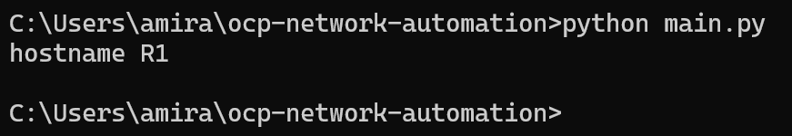

### v0.2 — 24 juin 2026 — Connexion multi-équipements
Connexion simultanée à R1, R2 et R3 — récupération du hostname de chaque équipement.

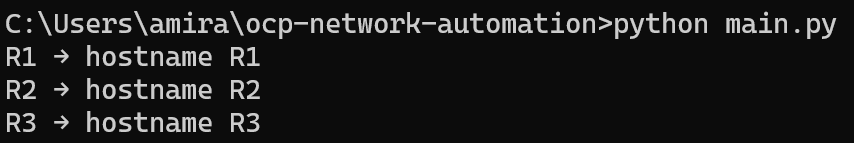
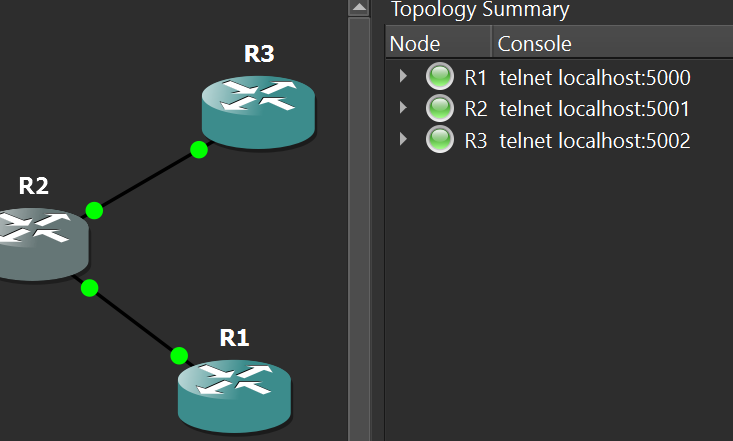

### v0.3 — 24 juin 2026 — Envoi de configuration groupée
Envoi de commandes de configuration sur R1, R2 et R3 simultanément via SSH.
Vérification appliquée directement sur les équipements.

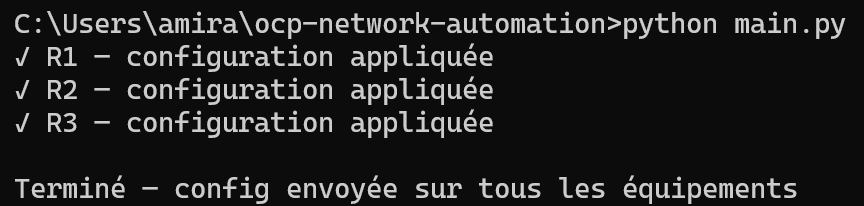
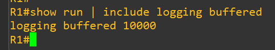

### v0.4 — 25 juin 2026 — Chargement des équipements depuis Excel
Import automatique de la liste des équipements depuis un fichier Excel (devices.xlsx).
Plus besoin de modifier le code pour ajouter un équipement.

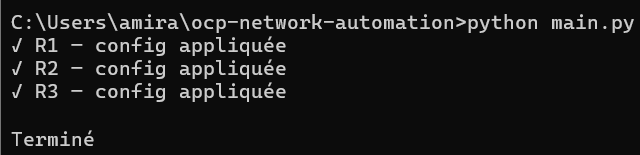
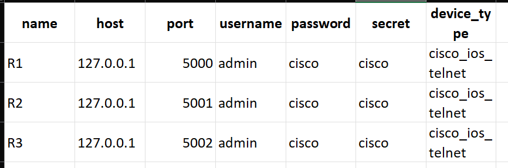

### v0.5 — 25 juin 2026 — Sauvegarde automatique des configurations
Sauvegarde automatique de la running-config de chaque équipement dans des fichiers horodatés.

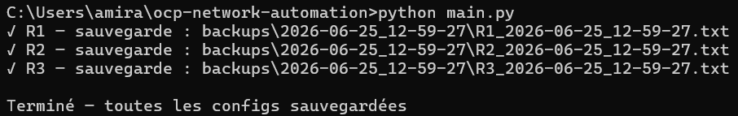
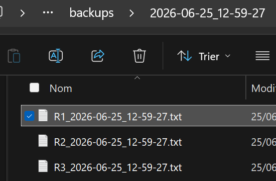

### v0.6 — 25 juin 2026 — Première interface graphique
Première version GUI avec Tkinter — boutons Envoyer Config et Sauvegarder avec log en temps réel.
Logo OCP intégré dans la barre de titre.

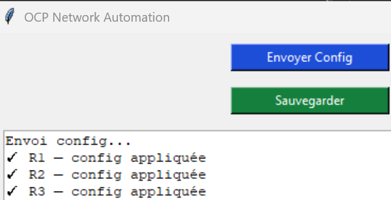

### v0.7 — 25 juin 2026 — Interface modernisée avec CustomTkinter
Interface repensée avec CustomTkinter — thème sombre, onglets Envoi Config et Sauvegarde.
Traitement en arrière-plan pour éviter le gel de l'interface dans les ancienne version.

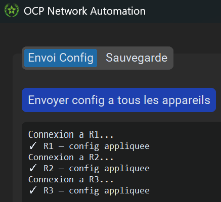
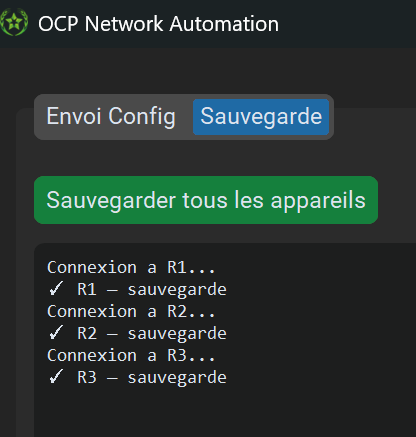

### v0.8 — 26 juin 2026 — Ajout onglet Scanner Réseau
Scan de sous-réseau en parallèle (50 threads) — détecte tous les hôtes actifs en temps réel.
Utile pour vérifier quels équipements sont en ligne avant de pousser une configuration.

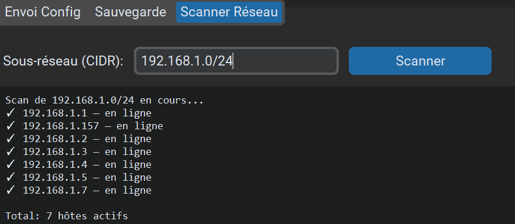

### v0.9 — 1 juillet 2026 — Test sur switch Cisco réel + améliorations UI
Premier test réussi sur un vrai switch Cisco Catalyst 3750 (WS-C3750V2-24TS) en environnement LAN.
- Ajout mode clair/sombre avec mémorisation
- Historique des scans cliquable
- Détection du type d'équipement (SSH/Telnet/RDP)
- Labels descriptifs sur chaque onglet

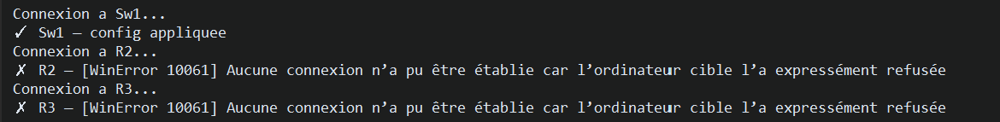
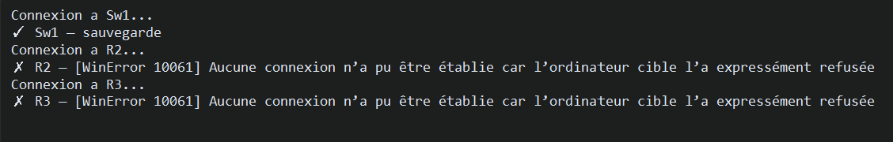
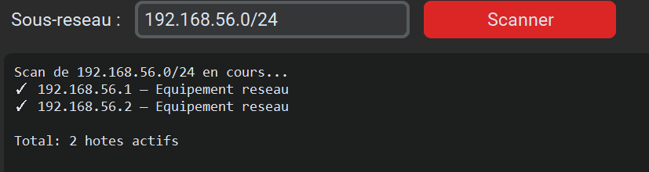

### v1.0 — 2 juillet 2026 — Zone de texte + chargement de fichier de commandes

Ajout d'une interface plus flexible pour l'envoi de configuration : possibilité de
taper les commandes directement dans l'application ou de charger un fichier .txt
existant, sans devoir passer uniquement par `commands.txt`.

- Zone de texte editable pour taper les commandes directement dans l'UI
- Bouton "Parcourir .txt" pour charger un fichier de commandes existant
- Priorite automatique : zone de texte > commands.txt si la zone est vide
- Fenetre redimensionnable avec taille minimale (UI ne casse plus en dessous d'une certaine taille)
- Teste et valide sur switch Cisco Catalyst 3750 reel (site Jorf Lasfar) :
  push de `service timestamps debug datetime msec localtime`, confirme via
  `show running-config | include service timestamps` en SSH direct

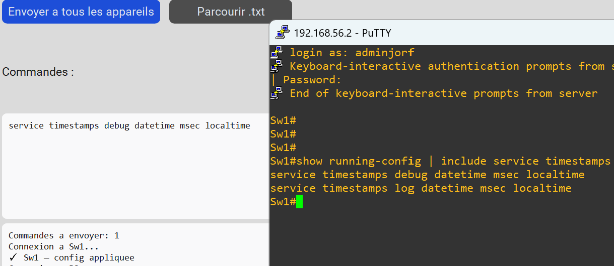
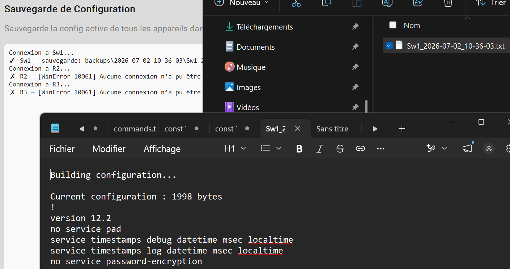

### v1.1 — 3 juillet 2026 — Corrections UX + détection d'erreurs + zoom

Corrections de bugs identifies lors des tests sur switch reel, et ajout de
controles pour rendre l'envoi de configuration plus sur.

- Bouton d'arret en cours d'envoi ("Arreter l'envoi") : empeche les clics multiples
  qui melangeaient le log de resultat
- Fix du glitch visuel au changement de theme dark/light
- Detection des commandes rejetees par le switch (`% Invalid input`, `% Incomplete
  command`, etc.) au lieu d'un faux message de succes
- Controles de zoom (+/-) : le contenu devient scrollable a tout niveau de zoom,
  la fenetre elle-meme ne change jamais de taille
- Correction du bouton de suppression dans l'historique du scanner, invisible en mode clair

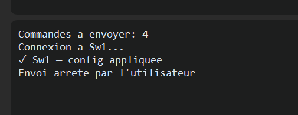
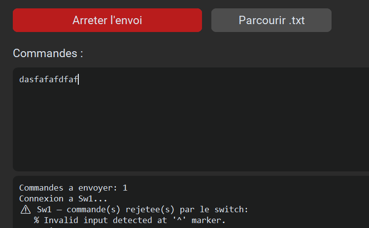


### v1.2 — 8 juillet 2026 — Scan reseau professionnel avec Nmap

Remplacement du scan basique (ping + test de 5 ports en dur) par un vrai scan
Nmap (python-nmap), avec detection de versions de services et d'OS.

- Detection des versions de services (ex: "HTTP: Huawei router http admin")
  au lieu de juste "port ouvert"
- Detection d'OS avec pourcentage de confiance (ex: "Linux 3.18.24 (96%)")
- Champ "Ports" configurable (syntaxe Nmap : liste ou plage), 9 ports par
  defaut adaptes a un contexte reseau/IT (SSH, Telnet, HTTP, NETCONF, etc.)
- Option "Sans decouverte (-Pn)" pour les hotes qui repondent au ping mais
  sont ignores par la decouverte standard
- Repli automatique sur le scan basique si Nmap/python-nmap est absent, avec
  message clair a l'utilisateur
- Bouton "Arreter le scan" : interruption reelle et immediate du scan Nmap en
  cours (pas juste a la fin), via arret direct du sous-processus
- Demarrage de l'application accelere (imports lourds charges a la demande
  plutot qu'au lancement)
- Temps total du scan affiche a la fin, pour comparaison

Teste sur reseau domestique reel : 7 hotes detectes sur un /24, avec
identification correcte du routeur (Huawei, Linux embarque, 96% de confiance).

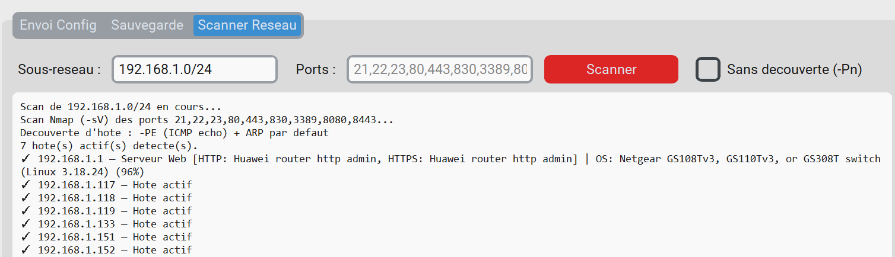
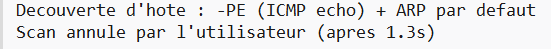
---

## Installation

```bash
pip install -r requirements.txt
```

## Lancer l'application

```bash
python main.py
```